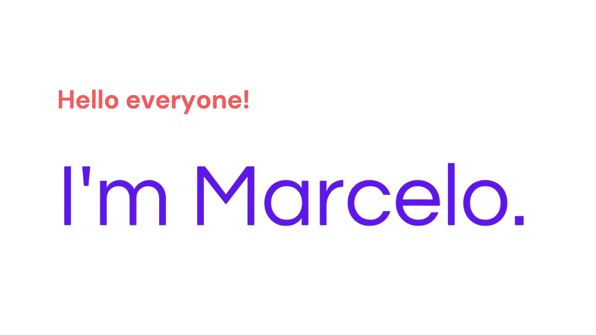

 

I’m a FrontEnd developer from Brazil 🇧🇷

**About me**

- 🎓 I’m currently learning: React, JavaScript, TipeScript
- 🤝 I’m looking to collaborate on: Mobile and Web Development
- 💬 Ask me about anything [here](https://github.com/buaretti/buaretti/issues)
  
#### Languages and Tools

<code></code>
<code></code>
<code></code>
<code></code>
<code></code>
<code></code>    

|  |  |
| ------------- | ------------- |

#### Top Repositories

 
 

